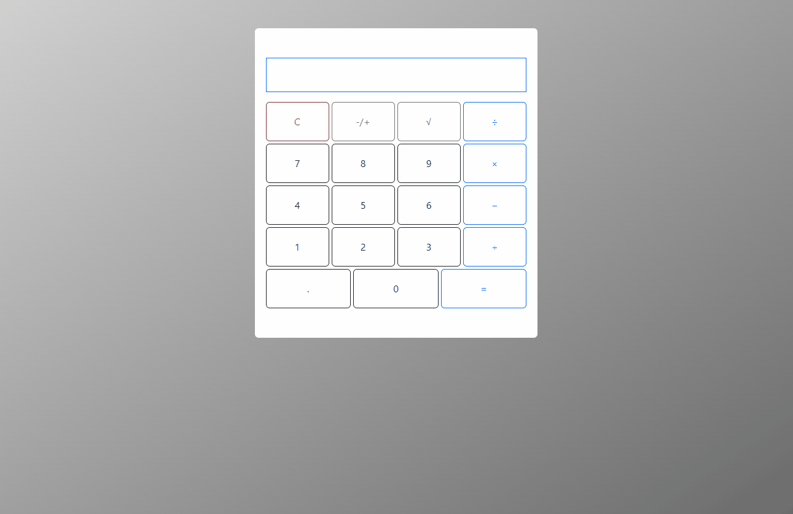

# Calculadora JavaScript
<link rel="stylesheet" href="https://cdn.jsdelivr.net/gh/devicons/devicon@v2.15.1/devicon.min.css">

## 👀 Visão Geral
Uma calculadora com as operações básicas utilizando Javascript para as operações lógicas e Bootstrap para o design

## ⚙️ Ferramentas
- <i class="devicon-javascript-plain colored"></i> Javascript
- <i class="devicon-bootstrap-plain colored"></i> Bootstrap
- <i class="devicon-html5-plain colored"></i> HTML5
- <i class="devicon-css3-plain colored"></i> CSS3

## 👨‍💻 Como Utilizar
Para utilizá-la basta acessar o seguinte link:
> [Link Calculadora JavaScript](https://viniciusg23.github.io/Calculadora-JavaScript/code)

## 🔍 Funcionalidades
Possui as funcionalidades-base de uma calculadora padrão com as quatro opções de operações matemáticas básicas, raiz quadrada e inversão de positivo para negativo e vice-versa. Além da função de limpar.

## 📜 Créditos
_Projeto Realizado Por:_ [Vinícius Gonzaga Guilherme](https://www.linkedin.com/in/vin%C3%ADcius-gonzaga-guilherme-9a65a722a/)

> ### Contate-me
> - <i class="devicon-linkedin-plain colored"></i> [LinkedIn](https://www.linkedin.com/in/vin%C3%ADcius-gonzaga-guilherme-9a65a722a/)
> - viniciusgonzagaguilherme@gmail.com
